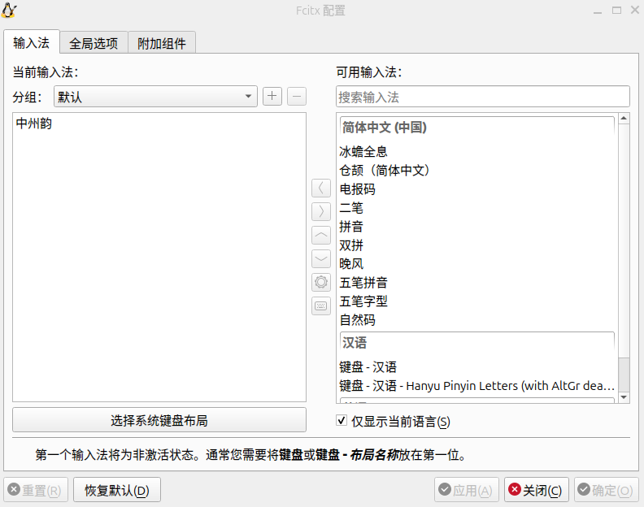
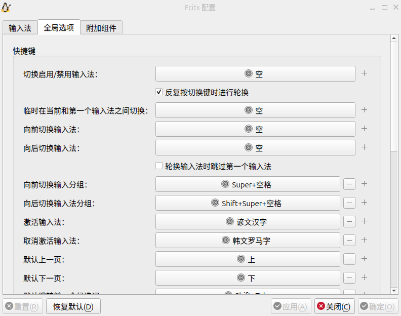
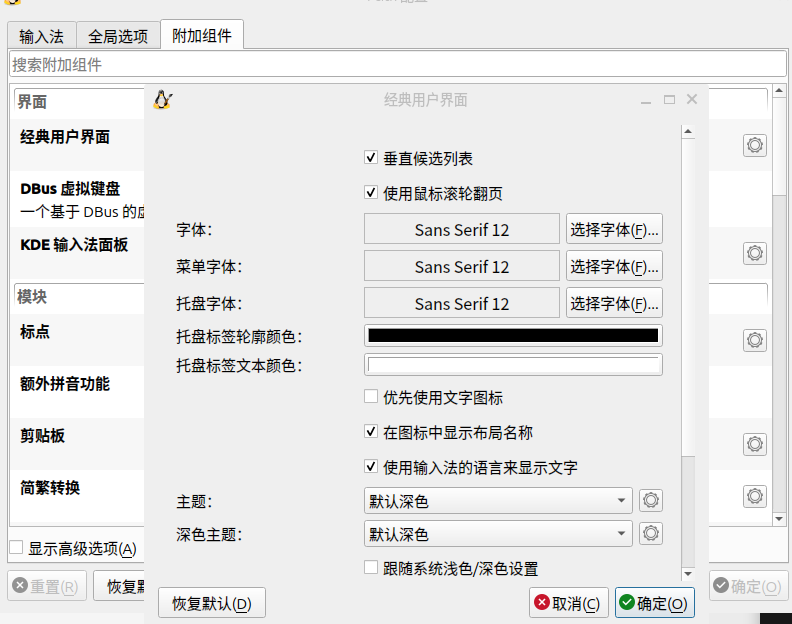
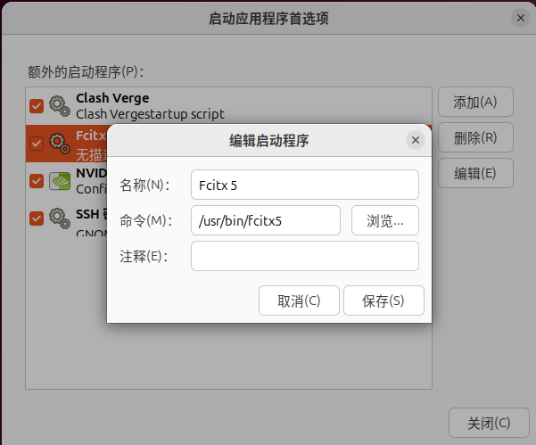

# 自用linux中文输入法配置

- Ubuntu/debian全系列
- gnome桌面环境


## 安装

```bash
sudo apt update
sudo apt install -y fcitx5 fcitx5-chinese-addons fcitx5-frontend-gtk3 fcitx5-frontend-gtk4 fcitx5-frontend-qt5 fcitx5-module-cloudpinyin fcitx5-rime
im-config -n fcitx5

echo "GTK_IM_MODULE DEFAULT=fcitx5" >> ~/.pam_environment
echo "QT_IM_MODULE DEFAULT=fcitx5" >> ~/.pam_environment
echo "XMODIFIERS DEFAULT=\@im=fcitx5" >> ~/.pam_environment
echo "SDL_IM_MODULE DEFAULT=fcitx5" >> ~/.pam_environment

mkdir -p $HOME/.local/share/fcitx5
git clone -b fcitx5 git@github.com:atopx/ibus-rime.git $HOME/.local/share/fcitx5/rime --depth 1

```


## 需要注销/重新登录

```bash
fcitx5-configtool # 从右侧可用输入法中选择“中州韵” 添加到左侧
```

## 全局选项选项配置

输入法选择



快捷键配置



主题/字体配置


## 部署

输入法托盘菜单点击重新启动，等待自动部署

## 自启动


